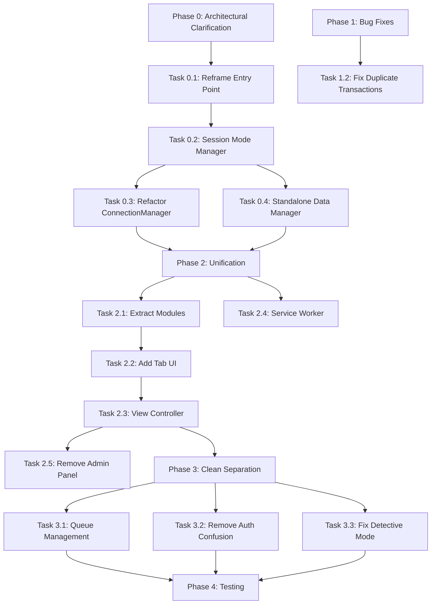

# ALN Architecture Fixes Implementation Plan - COMPREHENSIVE GUIDE

## Investigation Date: 2025-09-28 (Updated)
## Document Version: 2.0 - Complete Architectural Revision

## Executive Summary

During deep investigation of WebSocket issues, state persistence bugs, and architectural analysis, we discovered fundamental conceptual confusion in the system design. The core issue is conflation of THREE orthogonal concerns: **Game Session Mode** (Networked vs Standalone), **Scoring Mode** (Detective vs Black Market), and **Connection State** (Connected vs Disconnected). This document provides a detailed, step-by-step implementation plan to fix these issues and establish clean, maintainable architecture.

## Critical Architectural Discovery

### The Three Orthogonal Concerns

1. **Game Session Mode** (Chosen at start, NEVER changes during session):
   - **Networked Mode**: Playing with orchestrator server, all devices coordinate
   - **Standalone Mode**: Scanner-only via GitHub Pages, no orchestrator ever

2. **Scoring Mode** (Game mechanics, changeable during play):
   - **Detective Mode**: Narrative rewards, transactions recorded but not scored
   - **Black Market Mode**: Currency-based scoring with multipliers

3. **Connection State** (Only relevant in Networked Mode):
   - **Connected**: Real-time sync with orchestrator
   - **Disconnected**: Temporary network issue, queue for later sync

### Current Architectural Confusion

The system currently conflates these concerns with a `preferOffline` toggle that means different things in different contexts:
- Sometimes means "I don't have an orchestrator" (Standalone)
- Sometimes means "I'm temporarily disconnected" (Network issue)
- Sometimes means "I prefer not to connect" (User preference)

This confusion causes:
- Incorrect queue management (clearing standalone data on connection)
- Authentication failures (expecting orchestrator when none exists)
- State persistence bugs (not knowing what should persist)
- User experience issues (unclear what mode they're in)

## PHASE 0: ARCHITECTURAL CLARIFICATION (NEW - HIGHEST PRIORITY)

### Why This Phase First
**CRITICAL**: Without clarifying the conceptual model FIRST, all other fixes will be built on a flawed foundation. This phase establishes the correct mental model and user flow.

### Task 0.1: Reframe User Entry Point

**File**: `ALNScanner/index.html`
**Location**: Team entry screen (lines ~2000-2100)

**WHY**: Users need to explicitly choose their game mode at start. This is a SESSION characteristic, not a preference.

**CURRENT CODE** (Problematic):
```html
<button id="offlineModeToggle" onclick="toggleOfflineMode()">
  <span class="mode-icon">🌐</span>
  <span class="mode-text">Go Offline</span>
</button>
```

**NEW IMPLEMENTATION**:
```html
<!-- Replace team entry screen with mode selection first -->
<div id="gameModeScreen" class="screen active">
  <div class="mode-selection">
    <h2>How are you playing today?</h2>

    <button class="mode-option" onclick="App.selectGameMode('networked')">
      <span class="mode-icon">🌐</span>
      <h3>Networked Game</h3>
      <p>With orchestrator server for multi-device coordination</p>
    </button>

    <button class="mode-option" onclick="App.selectGameMode('standalone')">
      <span class="mode-icon">📱</span>
      <h3>Standalone Game</h3>
      <p>Scanner only, no server required</p>
    </button>
  </div>
</div>
```

**Dependencies**: None - this is the entry point

### Task 0.2: Implement Session Mode Manager

**File**: `ALNScanner/index.html`
**Location**: Add new class before ConnectionManager (~line 3500)

**WHY**: Central authority for session mode, prevents mode confusion throughout the app.

**IMPLEMENTATION**:
```javascript
class SessionModeManager {
  constructor() {
    this.mode = null; // 'networked' | 'standalone' | null
    this.locked = false; // Once set, cannot change during session
  }

  setMode(mode) {
    if (this.locked) {
      throw new Error('Cannot change session mode after game start');
    }

    if (mode !== 'networked' && mode !== 'standalone') {
      throw new Error('Invalid session mode');
    }

    this.mode = mode;
    this.locked = true;
    localStorage.setItem('gameSessionMode', mode);

    // Trigger appropriate initialization
    if (mode === 'networked') {
      this.initNetworkedMode();
    } else {
      this.initStandaloneMode();
    }
  }

  initNetworkedMode() {
    // Show connection wizard
    // Initialize ConnectionManager
    // Require successful connection before proceeding
    window.connectionManager = new ConnectionManager();
    window.connectionManager.showConnectionWizard();
  }

  initStandaloneMode() {
    // Skip all connection logic
    // Initialize local-only data manager
    window.dataManager = new StandaloneDataManager();
    // Proceed directly to team entry
    App.showTeamEntry();
  }

  isNetworked() {
    return this.mode === 'networked';
  }

  isStandalone() {
    return this.mode === 'standalone';
  }
}
```

**Dependencies**: Must complete before Task 0.3

### Task 0.3: Refactor ConnectionManager

**File**: `ALNScanner/index.html`
**Location**: ConnectionManager class (~line 3600)

**WHY**: Remove preferOffline confusion, make it ONLY handle networked mode connections.

**KEY CHANGES**:
```javascript
class ConnectionManager {
  constructor() {
    // REMOVE these confusing properties:
    // this.preferOffline = false;
    // this.STORAGE_KEYS.PREFER_OFFLINE = 'preferOfflineMode';

    // ADD clear intent:
    this.isNetworkedMode = true; // This class ONLY exists in networked mode
    this.connectionRequired = true; // Cannot proceed without connection
  }

  async connect() {
    // Remove preferOffline check - we're ALWAYS trying to connect in networked mode

    if (!this.url) {
      throw new Error('Cannot play networked game without orchestrator URL');
    }

    // Connection is REQUIRED, not optional
    try {
      await this.establishConnection();
    } catch (error) {
      this.showConnectionError('Networked game requires orchestrator connection');
      throw error; // Don't silently fail
    }
  }
}
```

**Dependencies**: Requires Task 0.2 completion

### Task 0.4: Create Standalone Data Manager

**File**: `ALNScanner/index.html`
**Location**: Add after ConnectionManager (~line 4000)

**WHY**: Standalone mode needs different data management - permanent local storage, not temporary queues.

**IMPLEMENTATION**:
```javascript
class StandaloneDataManager {
  constructor() {
    this.sessionData = {
      sessionId: this.generateLocalSessionId(),
      startTime: new Date().toISOString(),
      transactions: [],
      teams: {},
      mode: 'standalone'
    };

    // Load any previous incomplete session
    this.loadLocalSession();
  }

  generateLocalSessionId() {
    return `LOCAL_${Date.now()}_${Math.random().toString(36).substr(2, 9)}`;
  }

  addTransaction(transaction) {
    // Add to permanent local storage, not temporary queue
    this.sessionData.transactions.push(transaction);
    this.saveLocalSession();

    // Update local scores
    this.updateLocalScores(transaction);
  }

  saveLocalSession() {
    localStorage.setItem('standaloneSession', JSON.stringify(this.sessionData));
  }

  exportSession() {
    // Generate downloadable file
    const blob = new Blob([JSON.stringify(this.sessionData, null, 2)], {
      type: 'application/json'
    });
    const url = URL.createObjectURL(blob);
    const a = document.createElement('a');
    a.href = url;
    a.download = `ALN_Session_${this.sessionData.sessionId}.json`;
    a.click();
  }

  clearSession() {
    if (confirm('Export session data before clearing?')) {
      this.exportSession();
    }
    localStorage.removeItem('standaloneSession');
    this.sessionData.transactions = [];
  }
}
```

**Dependencies**: Requires Task 0.2 completion

## PHASE 1: CRITICAL BUG FIXES

### Task 1.1: Session State Reset ✅ ALREADY COMPLETED
**Status**: Fixed in `sessionService.js:56-61`
**Verification**: Test creating new session resets scores

### Task 1.2: Fix Duplicate Transaction Storage

**File**: `backend/src/services/transactionService.js`
**Location**: Lines 170-180 in `processTransaction` method

**WHY**: Transactions are being added twice:
1. Once in `transactionService.processTransaction()`
2. Again in `sessionService.addTransaction()`

**CURRENT PROBLEMATIC CODE**:
```javascript
// In transactionService.processTransaction():
if (session) {
  session.transactions.push(transaction); // FIRST ADD

  // Later in the same method:
  await sessionService.addTransaction(transaction); // SECOND ADD (calls session.addTransaction internally)
}
```

**FIX**:
```javascript
// In transactionService.processTransaction():
if (session) {
  // REMOVE this direct manipulation:
  // session.transactions.push(transaction);

  // Let sessionService handle it (it calls session.addTransaction internally):
  await sessionService.addTransaction(transaction); // SINGLE ADD
}
```

**VERIFICATION**:
1. Submit transaction via API
2. Check persistence file
3. Confirm exactly ONE entry with that transaction ID
4. Check `session.transactions.length` matches unique transaction count

**Dependencies**: None - can be done immediately

### Task 1.3: Remove Admin Panel Authentication Mismatch

**WHY**: Admin panel uses post-connect `gm:identify` event, but backend requires handshake auth. Instead of patching, we'll unify interfaces (Phase 2).

**ACTION**: Skip temporary fix, proceed to Phase 2 for permanent solution

**Dependencies**: None - intentionally skipping

## PHASE 2: INTERFACE UNIFICATION

### Task 2.1: Prepare for Modular Structure

**File**: `ALNScanner/index.html`
**Location**: After existing module definitions (~line 1500)

**WHY**: Extract code into logical modules for maintainability while keeping single-file deployment.

**STEP 1 - Extract Admin Functionality**:
```javascript
// Admin functionality module
const AdminModule = {
  // Session Management
  SessionManager: class {
    constructor(connection) {
      this.connection = connection;
      this.currentSession = null;
    }

    async createSession(name) {
      const response = await fetch('/api/sessions', {
        method: 'POST',
        headers: {
          'Content-Type': 'application/json',
          'Authorization': `Bearer ${this.connection.token}`
        },
        body: JSON.stringify({ name })
      });
      return response.json();
    }

    async pauseSession() {
      // Implementation from admin panel
    }

    async resumeSession() {
      // Implementation from admin panel
    }

    async endSession() {
      // Implementation from admin panel
    }
  },

  // Video Control
  VideoController: class {
    constructor(connection) {
      this.connection = connection;
    }

    async playVideo() {
      // Implementation from admin panel
    }

    async pauseVideo() {
      // Implementation from admin panel
    }

    async stopVideo() {
      // Implementation from admin panel
    }

    async skipVideo() {
      // Implementation from admin panel
    }
  },

  // System Monitoring
  SystemMonitor: class {
    constructor() {
      this.statusElements = {};
    }

    updateOrchestratorStatus(status) {
      // Update UI indicators
    }

    updateVLCStatus(status) {
      // Update UI indicators
    }

    updateDeviceList(devices) {
      // Update connected devices display
    }
  }
};
```

**Dependencies**: Must complete before Task 2.2

### Task 2.2: Add Tab Navigation UI

**File**: `ALNScanner/index.html`
**Location**: Replace top of container div (~line 250)

**WHY**: Provide seamless switching between scanner and admin functions.

**IMPLEMENTATION**:
```html
<!-- Add view selector at top of container -->
<div class="view-selector">
  <button class="view-tab active" data-view="scanner" onclick="App.switchView('scanner')">
    <span class="tab-icon">📱</span>
    <span class="tab-text">Scanner</span>
  </button>
  <button class="view-tab" data-view="admin" onclick="App.switchView('admin')">
    <span class="tab-icon">⚙️</span>
    <span class="tab-text">Admin</span>
  </button>
  <button class="view-tab" data-view="debug" onclick="App.switchView('debug')">
    <span class="tab-icon">🐛</span>
    <span class="tab-text">Debug</span>
  </button>
</div>

<!-- Scanner View (existing) -->
<div id="scanner-view" class="view-content active">
  <!-- Move existing scanner UI here -->
</div>

<!-- Admin View (new) -->
<div id="admin-view" class="view-content">
  <!-- Session Management Section -->
  <section class="admin-section">
    <h3>Session Management</h3>
    <div id="session-info">
      <span>Session ID: <span id="admin-session-id">-</span></span>
      <span>Status: <span id="admin-session-status">-</span></span>
    </div>
    <div class="session-controls">
      <button onclick="AdminModule.SessionManager.createSession()">New Session</button>
      <button onclick="AdminModule.SessionManager.pauseSession()">Pause</button>
      <button onclick="AdminModule.SessionManager.resumeSession()">Resume</button>
      <button onclick="AdminModule.SessionManager.endSession()">End</button>
    </div>
  </section>

  <!-- Video Controls Section -->
  <section class="admin-section">
    <h3>Video Controls</h3>
    <div id="video-info">
      <span>Current: <span id="admin-current-video">None</span></span>
      <span>Queue: <span id="admin-queue-length">0</span></span>
    </div>
    <div class="video-controls">
      <button onclick="AdminModule.VideoController.playVideo()">Play</button>
      <button onclick="AdminModule.VideoController.pauseVideo()">Pause</button>
      <button onclick="AdminModule.VideoController.stopVideo()">Stop</button>
      <button onclick="AdminModule.VideoController.skipVideo()">Skip</button>
    </div>
  </section>

  <!-- System Status Section -->
  <section class="admin-section">
    <h3>System Status</h3>
    <div class="status-grid">
      <div>Orchestrator: <span id="orchestrator-status">●</span></div>
      <div>VLC: <span id="vlc-status">●</span></div>
      <div>Devices: <span id="device-count">0</span></div>
    </div>
    <div id="device-list"></div>
  </section>

  <!-- Score Board Section -->
  <section class="admin-section">
    <h3>Team Scores</h3>
    <div id="admin-score-board"></div>
  </section>

  <!-- Transaction Log Section -->
  <section class="admin-section">
    <h3>Recent Transactions</h3>
    <div id="admin-transaction-log"></div>
  </section>
</div>

<!-- Debug View (existing) -->
<div id="debug-view" class="view-content">
  <!-- Existing debug panel -->
</div>
```

**Dependencies**: Requires Task 2.1 completion

### Task 2.3: Implement View Controller

**File**: `ALNScanner/index.html`
**Location**: In App object (~line 2800)

**WHY**: Manage view state and ensure single WebSocket connection across all views.

**IMPLEMENTATION**:
```javascript
// Add to App object:
viewController: {
  currentView: 'scanner',
  views: ['scanner', 'admin', 'debug'],
  sharedConnection: null,
  adminInstances: null,

  init() {
    // Initialize based on session mode
    if (window.sessionModeManager.isNetworked()) {
      this.sharedConnection = window.connectionManager.client;
      this.initAdminModules();
    }
  },

  initAdminModules() {
    this.adminInstances = {
      sessionManager: new AdminModule.SessionManager(this.sharedConnection),
      videoController: new AdminModule.VideoController(this.sharedConnection),
      systemMonitor: new AdminModule.SystemMonitor()
    };

    // Set up event listeners for admin events
    this.sharedConnection.on('session:update', (data) => {
      this.adminInstances.sessionManager.updateDisplay(data);
    });

    this.sharedConnection.on('video:status', (data) => {
      this.adminInstances.videoController.updateDisplay(data);
    });

    this.sharedConnection.on('device:connected', (data) => {
      this.adminInstances.systemMonitor.updateDeviceList(data);
    });
  },

  switchView(viewName) {
    if (!this.views.includes(viewName)) {
      console.error('Invalid view:', viewName);
      return;
    }

    // Hide all views
    document.querySelectorAll('.view-content').forEach(view => {
      view.classList.remove('active');
    });

    // Show selected view
    document.getElementById(`${viewName}-view`).classList.add('active');

    // Update tab highlighting
    document.querySelectorAll('.view-tab').forEach(tab => {
      tab.classList.remove('active');
    });
    document.querySelector(`[data-view="${viewName}"]`).classList.add('active');

    this.currentView = viewName;

    // Trigger view-specific initialization
    if (viewName === 'admin' && this.adminInstances) {
      this.adminInstances.sessionManager.refresh();
      this.adminInstances.systemMonitor.refresh();
    }
  }
}
```

**Dependencies**: Requires Tasks 2.1 and 2.2 completion

### Task 2.4: Add Service Worker Support

**File**: Create new `ALNScanner/sw.js`

**WHY**: Match player scanner PWA pattern for consistency and offline support in standalone mode.

**IMPLEMENTATION**:
```javascript
// sw.js
const CACHE_NAME = 'aln-gm-scanner-v1';
const urlsToCache = [
  './',
  './index.html',
  './data/tokens.json',
  'https://cdn.socket.io/4.5.4/socket.io.min.js'
];

self.addEventListener('install', event => {
  event.waitUntil(
    caches.open(CACHE_NAME)
      .then(cache => cache.addAll(urlsToCache))
  );
});

self.addEventListener('fetch', event => {
  event.respondWith(
    caches.match(event.request)
      .then(response => response || fetch(event.request))
  );
});
```

**In index.html, add**:
```javascript
// Register service worker
if ('serviceWorker' in navigator) {
  navigator.serviceWorker.register('sw.js')
    .then(reg => console.log('Service Worker registered'))
    .catch(err => console.log('Service Worker registration failed:', err));
}
```

**Dependencies**: None - can be done in parallel

### Task 2.5: Remove Standalone Admin Panel

**Files**: `backend/public/admin/*`

**WHY**: Functionality now integrated into unified GM scanner.

**IMPORTANT**: Archive first!
```bash
# Create backup
tar -czf admin-panel-backup.tar.gz backend/public/admin/

# Then remove
rm -rf backend/public/admin/
```

**Dependencies**: Must complete Tasks 2.1-2.3 first

## PHASE 3: CLEAN SEPARATION OF CONCERNS

### Task 3.1: Implement Proper Queue Management

**File**: `ALNScanner/index.html`
**Location**: Add after StandaloneDataManager (~line 4200)

**WHY**: Different session modes need completely different queue behavior.

**IMPLEMENTATION**:
```javascript
// For Networked Mode only
class NetworkedQueueManager {
  constructor(connection) {
    this.connection = connection;
    this.tempQueue = []; // Temporary queue for disconnections
    this.syncing = false;
  }

  queueTransaction(transaction) {
    // Only queue if disconnected
    if (!this.connection.isConnected) {
      this.tempQueue.push(transaction);
      this.saveQueue(); // Persist in case app closes
    } else {
      // Connected - send immediately
      this.connection.submitTransaction(transaction);
    }
  }

  saveQueue() {
    // Save to localStorage with clear key indicating temporary nature
    localStorage.setItem('networkedTempQueue', JSON.stringify(this.tempQueue));
  }

  async syncQueue() {
    if (this.syncing || this.tempQueue.length === 0) return;

    this.syncing = true;
    const failed = [];

    for (const transaction of this.tempQueue) {
      try {
        await this.connection.submitTransaction(transaction);
      } catch (error) {
        failed.push(transaction);
      }
    }

    // Only keep failed transactions in queue
    this.tempQueue = failed;

    if (failed.length === 0) {
      // All synced successfully - clear storage
      localStorage.removeItem('networkedTempQueue');
    } else {
      this.saveQueue();
    }

    this.syncing = false;
  }

  clearQueue() {
    // Only clear after successful sync confirmation
    this.tempQueue = [];
    localStorage.removeItem('networkedTempQueue');
  }
}
```

**Dependencies**: Requires Phase 0 completion

### Task 3.2: Remove Confusing Authentication Paths

**File**: `backend/src/websocket/gmAuth.js`
**Location**: Lines 18-28

**WHY**: The `gm:identify` handler expects pre-authentication from handshake but admin panel doesn't provide it.

**ACTION**: Since we're unifying interfaces, we can ensure ALL connections use handshake auth.

**VERIFICATION**:
```javascript
// All connections should now have auth in handshake:
io.use((socket, next) => {
  const { token, stationId, deviceType } = socket.handshake.auth || {};

  if (!token || !stationId || !deviceType) {
    return next(new Error('Authentication required'));
  }

  // Validate token and set socket properties
  socket.isAuthenticated = true;
  socket.deviceId = stationId;
  socket.deviceType = deviceType;

  next();
});
```

**Dependencies**: Requires Phase 2 completion

### Task 3.3: Clean Up Detective Mode Confusion

**File**: `ALNScanner/index.html`
**Location**: Transaction handling (~line 2400)

**WHY**: Detective mode is a SCORING mode, not a connection mode. Transactions should be handled the same way.

**CURRENT PROBLEMATIC CODE**:
```javascript
// Conflates detective mode with offline state
if (Settings.stationMode === 'detective') {
  localStorage.setItem('detectiveTransactions', ...);
}
```

**FIX**:
```javascript
// Clear separation
const transaction = {
  tokenId: tokenId,
  teamId: this.currentTeamId,
  stationMode: Settings.stationMode, // 'detective' or 'blackmarket' - just metadata
  timestamp: new Date().toISOString()
};

// Session mode determines storage, not scoring mode
if (window.sessionModeManager.isStandalone()) {
  window.dataManager.addTransaction(transaction);
} else if (window.sessionModeManager.isNetworked()) {
  window.queueManager.queueTransaction(transaction);
}
```

**Dependencies**: Requires Phase 0 completion

## PHASE 4: INTEGRATION TESTING

### Test Suite 4.1: Session Mode Selection

**Prerequisites**: All phases complete

**Test Steps**:
1. Clear all localStorage
2. Open GM scanner fresh
3. See game mode selection screen
4. Choose "Standalone" mode
5. **Verify**: No connection wizard appears
6. **Verify**: Can proceed directly to team entry
7. Submit 5 transactions
8. **Verify**: All stored locally
9. **Verify**: No network requests made
10. End session and export data
11. **Verify**: JSON file contains all transactions

**Expected Results**:
✅ No orchestrator connection attempts
✅ All data persisted locally
✅ Export generates valid JSON
✅ No errors in console

### Test Suite 4.2: Networked Mode with Disconnections

**Prerequisites**: Orchestrator running

**Test Steps**:
1. Clear all localStorage
2. Open GM scanner fresh
3. Choose "Networked" mode
4. **Verify**: Connection wizard appears
5. Enter orchestrator URL and authenticate
6. **Verify**: Connected successfully
7. Submit 3 transactions while connected
8. **Verify**: Transactions appear in orchestrator logs
9. Disconnect network (turn off WiFi)
10. Submit 2 more transactions
11. **Verify**: Transactions queued locally
12. Reconnect network
13. **Verify**: Queue automatically syncs
14. **Verify**: localStorage queue cleared after sync

**Expected Results**:
✅ Connection required for networked mode
✅ Transactions queue during disconnection
✅ Auto-sync on reconnection
✅ Queue cleared only after successful sync

### Test Suite 4.3: Admin Functionality in Unified Interface

**Prerequisites**: Networked mode, connected

**Test Steps**:
1. In scanner view, submit transaction
2. Switch to admin view
3. **Verify**: Transaction appears in log
4. Create new session from admin view
5. **Verify**: Session info updates
6. Switch to scanner view
7. **Verify**: Can submit transactions
8. Switch back to admin view
9. **Verify**: Scores updated
10. Control video playback
11. **Verify**: VLC responds
12. End session from admin view
13. **Verify**: Session ended properly

**Expected Results**:
✅ All admin functions work
✅ Single WebSocket connection maintained
✅ Real-time updates across views
✅ No duplicate events

### Test Suite 4.4: Score Persistence Fix Validation

**Prerequisites**: Backend running

**Test Steps**:
1. Create session "Game 1"
2. Submit transactions to reach scores: Team A: 100, Team B: 75
3. End session
4. Create session "Game 2"
5. **Verify**: Scores start at 0
6. Submit one transaction
7. **Verify**: Only new transaction points counted
8. Restart backend server
9. **Verify**: Scores remain correct (no rebuild from old session)

**Expected Results**:
✅ No score carryover between sessions
✅ Clean state on new session
✅ Correct persistence after restart

## Implementation Order & Dependencies



## Critical Implementation Notes

### Must Do:
1. **ALWAYS** test each phase independently before proceeding
2. **BACKUP** admin panel before deletion
3. **CLEAR** browser localStorage between test runs
4. **VERIFY** no console errors at each step

### Must NOT Do:
1. **DON'T** skip Phase 0 - it's the foundation
2. **DON'T** mix concerns - keep them orthogonal
3. **DON'T** use preferOffline pattern - it's ambiguous
4. **DON'T** assume connection state equals session mode

## Success Criteria Checklist

- [ ] Game mode explicitly chosen at start
- [ ] No conceptual confusion between session/scoring/connection
- [ ] Standalone mode never attempts connection
- [ ] Networked mode requires connection
- [ ] Queue management appropriate to mode
- [ ] No duplicate transactions
- [ ] No score carryover
- [ ] All admin features in unified interface
- [ ] Single WebSocket connection
- [ ] PWA support with service worker
- [ ] Clean separation of concerns
- [ ] All tests passing

## Post-Implementation Validation

After all phases complete:

1. **Code Review**: Ensure no references to `preferOffline` remain
2. **Documentation Update**: Update README with new architecture
3. **Performance Test**: Verify no memory leaks from queue management
4. **User Test**: Have someone unfamiliar test both modes
5. **Export Test**: Verify data export works in both modes

## Rollback Plan

If issues arise:

1. **Phase 0 Issues**: Revert to original entry flow, debug session mode logic
2. **Phase 1 Issues**: Revert transaction service changes, investigate persistence
3. **Phase 2 Issues**: Keep admin panel, continue using separate apps temporarily
4. **Phase 3 Issues**: Maintain temporary workarounds, fix incrementally

## Conclusion

This plan transforms a system with fundamental architectural confusion into a clean, maintainable architecture with clear separation of concerns. The key insight is recognizing that Game Session Mode (networked vs standalone) is fundamentally different from Scoring Mode (detective vs black market) and Connection State (connected vs disconnected). By clarifying these concepts first, then implementing the technical changes, we create a system that is both more robust and easier to understand.

## Appendix: Quick Reference

### Storage Keys After Implementation
```javascript
// Session Mode (permanent for session)
localStorage.gameSessionMode = 'networked' | 'standalone'

// Networked Mode Only
localStorage.networkedTempQueue = [...] // Cleared after sync
localStorage.orchestratorUrl = 'http://...'
localStorage.gmToken = 'jwt...'

// Standalone Mode Only
localStorage.standaloneSession = {...} // Permanent until export

// Shared (both modes)
localStorage.stationId = 'GM_001'
localStorage.stationMode = 'detective' | 'blackmarket' // Scoring mode
```

### Event Flow Diagrams

**Standalone Mode**:
```
User → Choose Standalone → Team Entry → Scan Token → Local Storage → Update UI
                                                          ↓
                                                   Export at End
```

**Networked Mode**:
```
User → Choose Networked → Connection Required → Team Entry → Scan Token
                              ↓                                   ↓
                          Orchestrator                   [Connected?]
                                                         /            \
                                                    Send Now      Queue Local
                                                        ↓              ↓
                                                  Orchestrator    On Reconnect
                                                                       ↓
                                                                  Sync & Clear
```

---

END OF COMPREHENSIVE IMPLEMENTATION GUIDE v2.0